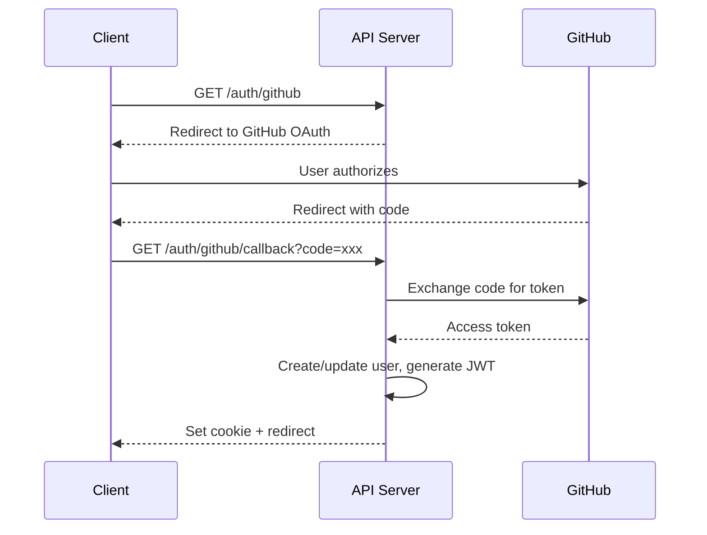

# GitDiscover API Specification

> RESTful API Design with OpenAPI 3.0

## API Overview

```yaml
Base URL: https://api.gitdiscover.dev/v1
Content-Type: application/json
Authentication: Bearer JWT (optional for public endpoints)
Rate Limit: 100 requests/minute (unauthenticated), 1000/minute (authenticated)
```

## Authentication

### GitHub OAuth Flow



### JWT Token Structure

```typescript
interface JWTPayload {
  sub: number;        // User ID
  login: string;      // GitHub username
  role: 'USER' | 'MODERATOR' | 'ADMIN';
  iat: number;        // Issued at
  exp: number;        // Expires (7 days)
}

// Example token payload
{
  "sub": 12345,
  "login": "octocat",
  "role": "USER",
  "iat": 1706745600,
  "exp": 1707350400
}
```

## Endpoints

### Repositories

#### List Trending Repositories

```http
GET /repositories
```

**Query Parameters:**

| Parameter | Type | Default | Description |
|-----------|------|---------|-------------|
| language | string | - | Filter by programming language |
| sort | string | score | Sort by: score, stars, forks, growth |
| period | string | daily | Time period: daily, weekly, monthly |
| limit | number | 20 | Results per page (max 100) |
| cursor | string | - | Pagination cursor |

**Response:**

```json
{
  "data": [
    {
      "id": 12345,
      "githubId": 123456789,
      "fullName": "vercel/next.js",
      "name": "next.js",
      "description": "The React Framework",
      "language": "TypeScript",
      "stars": 120000,
      "forks": 25000,
      "starsGrowth24h": 150,
      "forksGrowth24h": 30,
      "score": 125.5,
      "topics": ["react", "nextjs", "framework"],
      "owner": {
        "login": "vercel",
        "avatarUrl": "https://avatars.githubusercontent.com/u/14985020"
      },
      "pushedAt": "2026-01-31T10:00:00Z"
    }
  ],
  "cursor": "eyJpZCI6MTIzNDV9",
  "hasMore": true
}
```

#### Get Repository Detail

```http
GET /repositories/:fullName
```

**Path Parameters:**

| Parameter | Type | Description |
|-----------|------|-------------|
| fullName | string | Repository full name (owner/repo) |

**Response:**

```json
{
  "data": {
    "id": 12345,
    "githubId": 123456789,
    "fullName": "vercel/next.js",
    "name": "next.js",
    "description": "The React Framework",
    "language": "TypeScript",
    "stars": 120000,
    "forks": 25000,
    "watchers": 2500,
    "openIssues": 1500,
    "starsGrowth24h": 150,
    "forksGrowth24h": 30,
    "score": 125.5,
    "topics": ["react", "nextjs", "framework"],
    "license": "MIT",
    "homepage": "https://nextjs.org",
    "hasReadme": true,
    "hasLicense": true,
    "isArchived": false,
    "isFork": false,
    "owner": {
      "id": 100,
      "login": "vercel",
      "name": "Vercel",
      "avatarUrl": "https://avatars.githubusercontent.com/u/14985020"
    },
    "analysis": {
      "summary": "Next.js is a production-ready React framework...",
      "highlights": [
        "Server-side rendering",
        "Static site generation",
        "API routes"
      ],
      "useCases": [
        "E-commerce sites",
        "Marketing websites",
        "Web applications"
      ],
      "analysisDate": "2026-02-01"
    },
    "stats": {
      "bookmarks": 1500,
      "comments": 230,
      "voteScore": 450
    },
    "history": [
      {
        "date": "2026-01-25",
        "stars": 119500,
        "forks": 24800
      },
      {
        "date": "2026-01-26",
        "stars": 119650,
        "forks": 24850
      }
    ],
    "pushedAt": "2026-01-31T10:00:00Z",
    "repoCreatedAt": "2016-10-25T00:00:00Z"
  }
}
```

#### Search Repositories

```http
GET /repositories/search
```

**Query Parameters:**

| Parameter | Type | Default | Description |
|-----------|------|---------|-------------|
| q | string | required | Search query |
| language | string | - | Filter by language |
| limit | number | 20 | Results per page |

**Response:**

```json
{
  "data": [
    {
      "id": 12345,
      "fullName": "vercel/next.js",
      "name": "next.js",
      "description": "The React Framework",
      "language": "TypeScript",
      "stars": 120000,
      "score": 125.5,
      "relevance": 0.95
    }
  ],
  "total": 150,
  "query": "react framework"
}
```

### Developers

#### List Top Developers

```http
GET /developers
```

**Query Parameters:**

| Parameter | Type | Default | Description |
|-----------|------|---------|-------------|
| sort | string | impact | Sort by: impact, followers, stars |
| limit | number | 30 | Results per page (max 100) |
| cursor | string | - | Pagination cursor |

**Response:**

```json
{
  "data": [
    {
      "id": 100,
      "githubId": 1234567,
      "login": "sindresorhus",
      "name": "Sindre Sorhus",
      "avatarUrl": "https://avatars.githubusercontent.com/u/170270",
      "bio": "Full-Time Open-Sourcerer",
      "followers": 50000,
      "publicRepos": 1100,
      "totalStars": 500000,
      "impactScore": 8.5,
      "topRepos": [
        {
          "fullName": "sindresorhus/awesome",
          "stars": 280000
        }
      ]
    }
  ],
  "cursor": "eyJpZCI6MTAwfQ",
  "hasMore": true
}
```

#### Get Developer Detail

```http
GET /developers/:login
```

**Response:**

```json
{
  "data": {
    "id": 100,
    "githubId": 1234567,
    "login": "sindresorhus",
    "name": "Sindre Sorhus",
    "avatarUrl": "https://avatars.githubusercontent.com/u/170270",
    "bio": "Full-Time Open-Sourcerer",
    "company": null,
    "location": "Thailand",
    "blog": "https://sindresorhus.com",
    "twitterUsername": "sindresorhus",
    "followers": 50000,
    "following": 50,
    "publicRepos": 1100,
    "totalStars": 500000,
    "impactScore": 8.5,
    "contributions": 3500,
    "repositories": [
      {
        "id": 200,
        "fullName": "sindresorhus/awesome",
        "stars": 280000,
        "language": null
      }
    ],
    "history": [
      {
        "date": "2026-01-25",
        "followers": 49800,
        "totalStars": 498000
      }
    ],
    "devCreatedAt": "2011-01-01T00:00:00Z"
  }
}
```

### Trends

#### Get Language Trends

```http
GET /trends/languages
```

**Query Parameters:**

| Parameter | Type | Default | Description |
|-----------|------|---------|-------------|
| period | string | weekly | Time period: daily, weekly, monthly |

**Response:**

```json
{
  "data": [
    {
      "language": "TypeScript",
      "repos": 15000,
      "stars": 2500000,
      "growth": 12.5,
      "trend": "up"
    },
    {
      "language": "Rust",
      "repos": 8000,
      "stars": 1200000,
      "growth": 18.2,
      "trend": "up"
    }
  ],
  "period": "weekly",
  "generatedAt": "2026-02-01T00:00:00Z"
}
```

#### Get Topic Trends

```http
GET /trends/topics
```

**Response:**

```json
{
  "data": [
    {
      "topic": "ai",
      "repos": 5000,
      "growth": 45.2,
      "relatedTopics": ["machine-learning", "llm", "gpt"]
    },
    {
      "topic": "rust",
      "repos": 3500,
      "growth": 22.1,
      "relatedTopics": ["systems-programming", "wasm"]
    }
  ],
  "period": "weekly"
}
```

#### Get Growth Rankings

```http
GET /trends/growth
```

**Query Parameters:**

| Parameter | Type | Default | Description |
|-----------|------|---------|-------------|
| metric | string | stars | Metric: stars, forks, score |
| period | string | daily | Period: daily, weekly, monthly |
| limit | number | 10 | Results count |

**Response:**

```json
{
  "data": [
    {
      "rank": 1,
      "repository": {
        "id": 12345,
        "fullName": "openai/gpt-5",
        "language": "Python"
      },
      "growth": 5000,
      "growthPercent": 250.0,
      "previousValue": 2000,
      "currentValue": 7000
    }
  ],
  "metric": "stars",
  "period": "daily"
}
```

### Community

#### Bookmarks

```http
GET /bookmarks
Authorization: Bearer <token>
```

**Response:**

```json
{
  "data": [
    {
      "id": 1,
      "repository": {
        "id": 12345,
        "fullName": "vercel/next.js",
        "stars": 120000
      },
      "note": "Great for my next project",
      "tags": ["frontend", "react"],
      "createdAt": "2026-01-15T10:00:00Z"
    }
  ]
}
```

```http
POST /bookmarks
Authorization: Bearer <token>
Content-Type: application/json

{
  "repositoryId": 12345,
  "note": "Great for my next project",
  "tags": ["frontend", "react"]
}
```

**Response:**

```json
{
  "data": {
    "id": 1,
    "repositoryId": 12345,
    "note": "Great for my next project",
    "tags": ["frontend", "react"],
    "createdAt": "2026-01-15T10:00:00Z"
  }
}
```

```http
DELETE /bookmarks/:repositoryId
Authorization: Bearer <token>
```

**Response:**

```json
{
  "success": true
}
```

#### Comments

```http
GET /repositories/:fullName/comments
```

**Query Parameters:**

| Parameter | Type | Default | Description |
|-----------|------|---------|-------------|
| sort | string | newest | Sort: newest, oldest, popular |
| limit | number | 20 | Results per page |
| cursor | string | - | Pagination cursor |

**Response:**

```json
{
  "data": [
    {
      "id": 1,
      "content": "This framework changed how I build web apps!",
      "user": {
        "id": 50,
        "login": "developer123",
        "avatarUrl": "https://avatars.githubusercontent.com/u/50"
      },
      "replies": [
        {
          "id": 2,
          "content": "Totally agree!",
          "user": {
            "login": "coder456"
          },
          "createdAt": "2026-01-16T12:00:00Z"
        }
      ],
      "createdAt": "2026-01-15T10:00:00Z",
      "isEdited": false
    }
  ],
  "cursor": "eyJpZCI6MX0",
  "hasMore": true
}
```

```http
POST /repositories/:fullName/comments
Authorization: Bearer <token>
Content-Type: application/json

{
  "content": "This framework changed how I build web apps!",
  "parentId": null
}
```

```http
PUT /comments/:id
Authorization: Bearer <token>
Content-Type: application/json

{
  "content": "Updated comment content"
}
```

```http
DELETE /comments/:id
Authorization: Bearer <token>
```

#### Votes

```http
POST /repositories/:fullName/vote
Authorization: Bearer <token>
Content-Type: application/json

{
  "value": 1
}
```

**Response:**

```json
{
  "data": {
    "repositoryId": 12345,
    "userVote": 1,
    "totalScore": 451
  }
}
```

### User

#### Get Current User

```http
GET /user
Authorization: Bearer <token>
```

**Response:**

```json
{
  "data": {
    "id": 50,
    "githubId": 12345678,
    "login": "developer123",
    "name": "John Developer",
    "email": "john@example.com",
    "avatarUrl": "https://avatars.githubusercontent.com/u/50",
    "role": "USER",
    "stats": {
      "bookmarks": 25,
      "comments": 10,
      "votes": 50
    },
    "createdAt": "2026-01-01T00:00:00Z"
  }
}
```

### AI Analysis

#### Get Repository Analysis

```http
GET /repositories/:fullName/analysis
```

**Response:**

```json
{
  "data": {
    "repositoryId": 12345,
    "analysisDate": "2026-02-01",
    "summary": "Next.js is a production-ready React framework that enables server-side rendering and static site generation...",
    "highlights": [
      "Hybrid SSR/SSG support",
      "Built-in API routes",
      "Automatic code splitting",
      "Image optimization",
      "Incremental Static Regeneration"
    ],
    "useCases": [
      "E-commerce platforms requiring SEO",
      "Marketing websites with dynamic content",
      "Dashboard applications",
      "Blog platforms"
    ],
    "techStack": {
      "runtime": "Node.js",
      "framework": "React",
      "styling": ["CSS Modules", "Tailwind CSS"],
      "deployment": ["Vercel", "Docker", "Node.js server"]
    },
    "codeQuality": {
      "documentation": "excellent",
      "testCoverage": "high",
      "maintainability": "excellent",
      "communityHealth": "very active"
    },
    "similarRepos": [
      {
        "id": 200,
        "fullName": "remix-run/remix",
        "similarity": 0.85
      },
      {
        "id": 201,
        "fullName": "nuxt/nuxt",
        "similarity": 0.75
      }
    ],
    "targetAudience": "Frontend developers building production React applications",
    "modelVersion": "gpt-4o-mini-2024-07-18"
  }
}
```

## Error Handling

### Error Response Format

```json
{
  "error": {
    "code": "VALIDATION_ERROR",
    "message": "Invalid request parameters",
    "details": [
      {
        "field": "limit",
        "message": "Must be between 1 and 100"
      }
    ]
  }
}
```

### Error Codes

| HTTP Status | Code | Description |
|-------------|------|-------------|
| 400 | VALIDATION_ERROR | Invalid request parameters |
| 400 | INVALID_CURSOR | Invalid pagination cursor |
| 401 | UNAUTHORIZED | Missing or invalid token |
| 403 | FORBIDDEN | Insufficient permissions |
| 404 | NOT_FOUND | Resource not found |
| 409 | CONFLICT | Resource already exists |
| 429 | RATE_LIMITED | Too many requests |
| 500 | INTERNAL_ERROR | Server error |
| 503 | SERVICE_UNAVAILABLE | Service temporarily unavailable |

### Error Handling Implementation

```typescript
// Error classes
class AppError extends Error {
  constructor(
    public code: string,
    public message: string,
    public statusCode: number,
    public details?: unknown
  ) {
    super(message);
  }
}

class ValidationError extends AppError {
  constructor(details: { field: string; message: string }[]) {
    super('VALIDATION_ERROR', 'Invalid request parameters', 400, details);
  }
}

class NotFoundError extends AppError {
  constructor(resource: string) {
    super('NOT_FOUND', `${resource} not found`, 404);
  }
}

// Error handler middleware
function errorHandler(error: Error, req: Request, res: Response) {
  if (error instanceof AppError) {
    return res.status(error.statusCode).json({
      error: {
        code: error.code,
        message: error.message,
        details: error.details,
      },
    });
  }

  // Log unexpected errors
  logger.error({ err: error }, 'Unexpected error');

  return res.status(500).json({
    error: {
      code: 'INTERNAL_ERROR',
      message: 'An unexpected error occurred',
    },
  });
}
```

## Rate Limiting

### Rate Limit Headers

```http
X-RateLimit-Limit: 100
X-RateLimit-Remaining: 95
X-RateLimit-Reset: 1706745660
```

### Rate Limit Configuration

```typescript
// Rate limit tiers
const RATE_LIMITS = {
  anonymous: {
    windowMs: 60 * 1000,  // 1 minute
    max: 100,
  },
  authenticated: {
    windowMs: 60 * 1000,
    max: 1000,
  },
  premium: {
    windowMs: 60 * 1000,
    max: 5000,
  },
};

// Implementation with Redis
import { RateLimiterRedis } from 'rate-limiter-flexible';

const rateLimiter = new RateLimiterRedis({
  storeClient: redisClient,
  keyPrefix: 'ratelimit',
  points: 100,
  duration: 60,
});

async function rateLimitMiddleware(req: Request, res: Response, next: NextFunction) {
  const key = req.user?.id || req.ip;
  const limit = req.user ? RATE_LIMITS.authenticated : RATE_LIMITS.anonymous;

  try {
    const result = await rateLimiter.consume(key);

    res.set({
      'X-RateLimit-Limit': limit.max,
      'X-RateLimit-Remaining': result.remainingPoints,
      'X-RateLimit-Reset': Math.floor(Date.now() / 1000) + result.msBeforeNext / 1000,
    });

    next();
  } catch (error) {
    res.status(429).json({
      error: {
        code: 'RATE_LIMITED',
        message: 'Too many requests',
        retryAfter: Math.ceil(error.msBeforeNext / 1000),
      },
    });
  }
}
```

## API Versioning

### Version Strategy

```
URL Path Versioning: /v1/repositories, /v2/repositories
Header Versioning (future): Accept: application/vnd.gitdiscover.v1+json
```

### Deprecation Policy

```http
# Deprecated endpoint response headers
Deprecation: true
Sunset: Sat, 01 Jun 2026 00:00:00 GMT
Link: </v2/repositories>; rel="successor-version"
```

## OpenAPI Specification

```yaml
openapi: 3.0.3
info:
  title: GitDiscover API
  description: GitHub Discovery Platform API
  version: 1.0.0
  contact:
    email: api@gitdiscover.dev
  license:
    name: MIT
    url: https://opensource.org/licenses/MIT

servers:
  - url: https://api.gitdiscover.dev/v1
    description: Production server
  - url: http://localhost:3001/v1
    description: Development server

tags:
  - name: repositories
    description: Repository discovery and details
  - name: developers
    description: Developer discovery and profiles
  - name: trends
    description: Trend analytics
  - name: community
    description: Bookmarks, comments, votes
  - name: auth
    description: Authentication

paths:
  /repositories:
    get:
      tags:
        - repositories
      summary: List trending repositories
      operationId: listRepositories
      parameters:
        - name: language
          in: query
          schema:
            type: string
          description: Filter by programming language
        - name: sort
          in: query
          schema:
            type: string
            enum: [score, stars, forks, growth]
            default: score
        - name: period
          in: query
          schema:
            type: string
            enum: [daily, weekly, monthly]
            default: daily
        - name: limit
          in: query
          schema:
            type: integer
            minimum: 1
            maximum: 100
            default: 20
        - name: cursor
          in: query
          schema:
            type: string
      responses:
        '200':
          description: Successful response
          content:
            application/json:
              schema:
                $ref: '#/components/schemas/RepositoryListResponse'
        '400':
          $ref: '#/components/responses/BadRequest'
        '429':
          $ref: '#/components/responses/RateLimited'

  /repositories/{fullName}:
    get:
      tags:
        - repositories
      summary: Get repository details
      operationId: getRepository
      parameters:
        - name: fullName
          in: path
          required: true
          schema:
            type: string
          example: vercel/next.js
      responses:
        '200':
          description: Successful response
          content:
            application/json:
              schema:
                $ref: '#/components/schemas/RepositoryDetailResponse'
        '404':
          $ref: '#/components/responses/NotFound'

components:
  schemas:
    Repository:
      type: object
      properties:
        id:
          type: integer
        githubId:
          type: integer
          format: int64
        fullName:
          type: string
        name:
          type: string
        description:
          type: string
          nullable: true
        language:
          type: string
          nullable: true
        stars:
          type: integer
        forks:
          type: integer
        starsGrowth24h:
          type: integer
        forksGrowth24h:
          type: integer
        score:
          type: number
          format: float
        topics:
          type: array
          items:
            type: string
        owner:
          $ref: '#/components/schemas/RepositoryOwner'
        pushedAt:
          type: string
          format: date-time

    RepositoryOwner:
      type: object
      properties:
        login:
          type: string
        avatarUrl:
          type: string
          format: uri

    RepositoryListResponse:
      type: object
      properties:
        data:
          type: array
          items:
            $ref: '#/components/schemas/Repository'
        cursor:
          type: string
          nullable: true
        hasMore:
          type: boolean

    RepositoryDetailResponse:
      type: object
      properties:
        data:
          allOf:
            - $ref: '#/components/schemas/Repository'
            - type: object
              properties:
                watchers:
                  type: integer
                openIssues:
                  type: integer
                license:
                  type: string
                homepage:
                  type: string
                analysis:
                  $ref: '#/components/schemas/AiAnalysis'
                stats:
                  $ref: '#/components/schemas/RepositoryStats'
                history:
                  type: array
                  items:
                    $ref: '#/components/schemas/RepositorySnapshot'

    AiAnalysis:
      type: object
      properties:
        summary:
          type: string
        highlights:
          type: array
          items:
            type: string
        useCases:
          type: array
          items:
            type: string
        analysisDate:
          type: string
          format: date

    RepositoryStats:
      type: object
      properties:
        bookmarks:
          type: integer
        comments:
          type: integer
        voteScore:
          type: integer

    RepositorySnapshot:
      type: object
      properties:
        date:
          type: string
          format: date
        stars:
          type: integer
        forks:
          type: integer

    Error:
      type: object
      properties:
        error:
          type: object
          properties:
            code:
              type: string
            message:
              type: string
            details:
              type: array
              items:
                type: object

  responses:
    BadRequest:
      description: Bad request
      content:
        application/json:
          schema:
            $ref: '#/components/schemas/Error'

    NotFound:
      description: Resource not found
      content:
        application/json:
          schema:
            $ref: '#/components/schemas/Error'

    RateLimited:
      description: Rate limit exceeded
      headers:
        X-RateLimit-Limit:
          schema:
            type: integer
        X-RateLimit-Remaining:
          schema:
            type: integer
        X-RateLimit-Reset:
          schema:
            type: integer
      content:
        application/json:
          schema:
            $ref: '#/components/schemas/Error'

  securitySchemes:
    bearerAuth:
      type: http
      scheme: bearer
      bearerFormat: JWT

security:
  - {}
  - bearerAuth: []
```

## SDK Examples

### JavaScript/TypeScript

```typescript
// GitDiscover API Client
class GitDiscoverClient {
  private baseUrl: string;
  private token?: string;

  constructor(options: { baseUrl?: string; token?: string } = {}) {
    this.baseUrl = options.baseUrl || 'https://api.gitdiscover.dev/v1';
    this.token = options.token;
  }

  private async request<T>(
    path: string,
    options: RequestInit = {}
  ): Promise<T> {
    const headers: HeadersInit = {
      'Content-Type': 'application/json',
      ...(this.token && { Authorization: `Bearer ${this.token}` }),
      ...options.headers,
    };

    const response = await fetch(`${this.baseUrl}${path}`, {
      ...options,
      headers,
    });

    if (!response.ok) {
      const error = await response.json();
      throw new Error(error.error.message);
    }

    return response.json();
  }

  // Repositories
  async listRepositories(params?: {
    language?: string;
    sort?: 'score' | 'stars' | 'forks' | 'growth';
    limit?: number;
    cursor?: string;
  }) {
    const query = new URLSearchParams(params as Record<string, string>);
    return this.request<RepositoryListResponse>(
      `/repositories?${query}`
    );
  }

  async getRepository(fullName: string) {
    return this.request<RepositoryDetailResponse>(
      `/repositories/${encodeURIComponent(fullName)}`
    );
  }

  // Developers
  async listDevelopers(params?: {
    sort?: 'impact' | 'followers' | 'stars';
    limit?: number;
    cursor?: string;
  }) {
    const query = new URLSearchParams(params as Record<string, string>);
    return this.request<DeveloperListResponse>(
      `/developers?${query}`
    );
  }

  // Bookmarks (requires auth)
  async addBookmark(repositoryId: number, note?: string, tags?: string[]) {
    return this.request<BookmarkResponse>('/bookmarks', {
      method: 'POST',
      body: JSON.stringify({ repositoryId, note, tags }),
    });
  }
}

// Usage
const client = new GitDiscoverClient({ token: 'your-jwt-token' });

const repos = await client.listRepositories({
  language: 'TypeScript',
  sort: 'score',
  limit: 10,
});

const repo = await client.getRepository('vercel/next.js');
```

---

Document Version: 1.0.0
Last Updated: 2026-02-01
