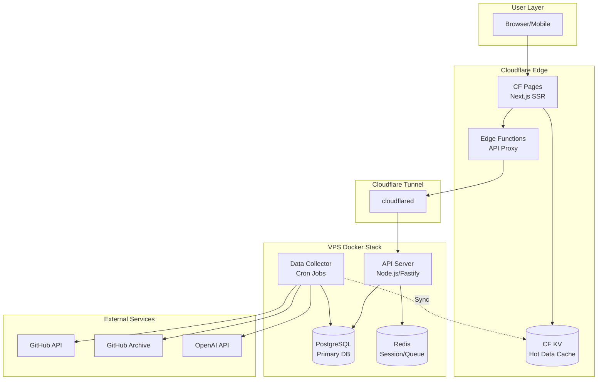
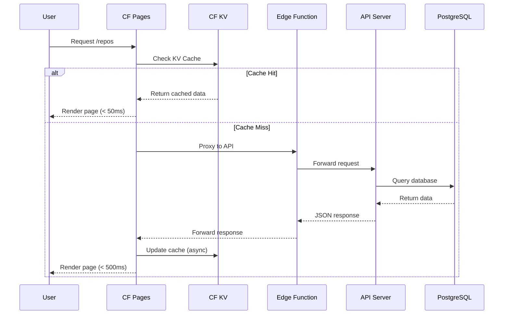
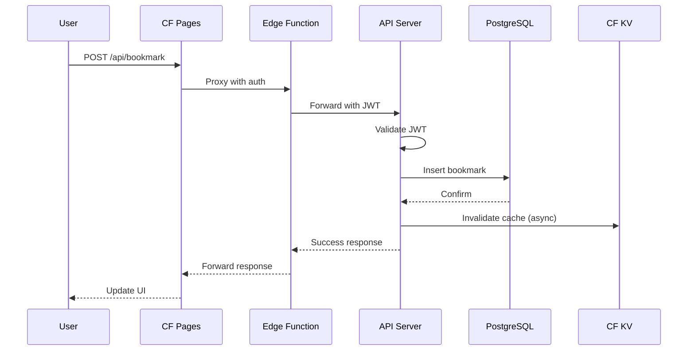
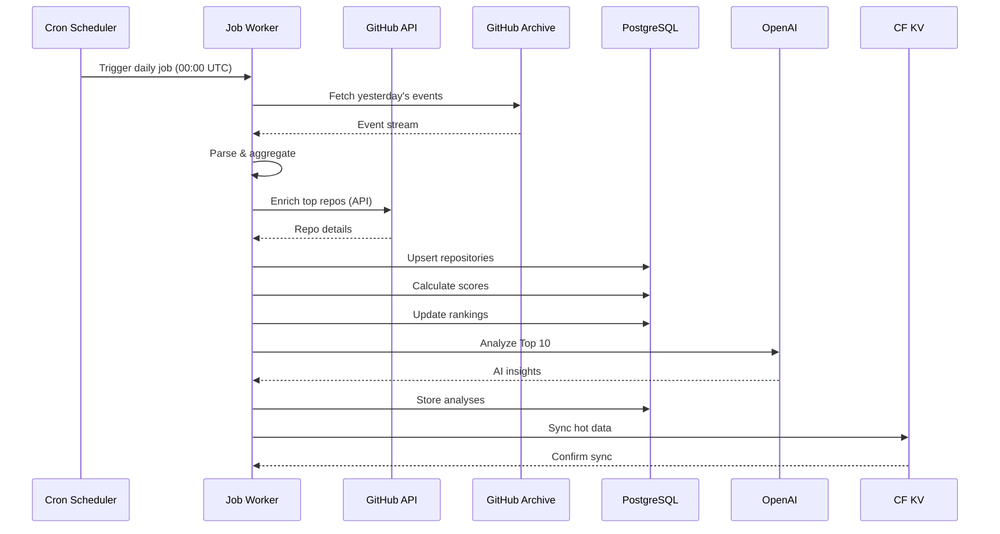
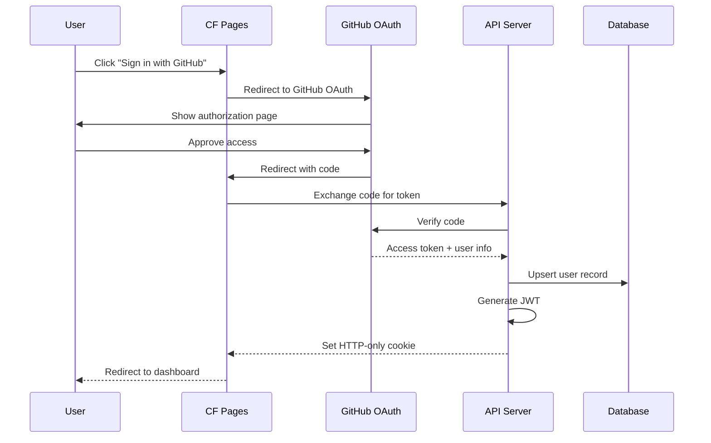

# GitDiscover Architecture

> System Design for GitHub Discovery Platform

## System Overview



## Technology Stack

### Frontend (Cloudflare Pages)

| Layer | Technology | Rationale |
|-------|------------|-----------|
| Framework | Next.js 14 (App Router) | SSR + Edge Runtime support |
| Runtime | Cloudflare Workers | Global edge deployment |
| Styling | Tailwind CSS | Utility-first, small bundle |
| State | Zustand | Lightweight, TypeScript-first |
| Charts | Recharts | React-native, SSR compatible |
| Icons | Lucide React | Tree-shakeable, consistent |

### Backend (VPS Docker)

| Layer | Technology | Rationale |
|-------|------------|-----------|
| API Server | Fastify | Fastest Node.js framework |
| ORM | Prisma | Type-safe, great DX |
| Database | PostgreSQL 16 | JSONB, full-text search |
| Cache | Redis 7 | Session, rate limiting |
| Queue | BullMQ | Reliable job processing |
| Scheduler | node-cron | Simple, reliable |

### Infrastructure

| Layer | Technology | Rationale |
|-------|------------|-----------|
| CDN | Cloudflare | Free, global, fast |
| Tunnel | cloudflared | Secure VPS exposure |
| Container | Docker Compose | Simple orchestration |
| Monitoring | Grafana + Loki | Free, powerful |
| Backup | restic + B2 | Encrypted, cheap |

## Data Flow Architecture

### Read Path (Optimized for Speed)



### Write Path (Optimized for Consistency)



### Data Collection Pipeline



## Caching Strategy

### Multi-Layer Cache Architecture

```
┌─────────────────────────────────────────────────────────────┐
│ Layer 1: Browser Cache (Client)                             │
│ - Static assets: 1 year (immutable)                         │
│ - API responses: 5 minutes (stale-while-revalidate)         │
└─────────────────────────────────────────────────────────────┘
                              ↓
┌─────────────────────────────────────────────────────────────┐
│ Layer 2: Cloudflare Edge Cache                              │
│ - HTML pages: 1 hour (s-maxage)                             │
│ - API responses: 5 minutes                                  │
│ - Automatic purge on deploy                                 │
└─────────────────────────────────────────────────────────────┘
                              ↓
┌─────────────────────────────────────────────────────────────┐
│ Layer 3: Cloudflare KV (Hot Data)                           │
│ - Daily rankings: 1 hour TTL                                │
│ - Repository details: 6 hours TTL                           │
│ - Developer profiles: 6 hours TTL                           │
│ - AI analyses: 24 hours TTL                                 │
└─────────────────────────────────────────────────────────────┘
                              ↓
┌─────────────────────────────────────────────────────────────┐
│ Layer 4: Redis (Session & Rate Limit)                       │
│ - User sessions: 7 days TTL                                 │
│ - Rate limit counters: 1 minute TTL                         │
│ - Job queues: persistent                                    │
└─────────────────────────────────────────────────────────────┘
                              ↓
┌─────────────────────────────────────────────────────────────┐
│ Layer 5: PostgreSQL (Source of Truth)                       │
│ - All persistent data                                       │
│ - Query result caching via prepared statements              │
└─────────────────────────────────────────────────────────────┘
```

### Cache Key Design

```typescript
// KV Cache Keys
const CACHE_KEYS = {
  // Rankings (updated hourly)
  DAILY_REPOS: (date: string, lang?: string) =>
    `rankings:repos:${date}${lang ? `:${lang}` : ''}`,
  DAILY_DEVELOPERS: (date: string) =>
    `rankings:devs:${date}`,

  // Details (updated on change)
  REPO_DETAIL: (id: number) => `repo:${id}`,
  DEV_DETAIL: (id: number) => `dev:${id}`,

  // AI Analysis (updated daily)
  AI_ANALYSIS: (repoId: number, date: string) =>
    `ai:${repoId}:${date}`,

  // Aggregates
  LANGUAGE_STATS: (date: string) => `stats:langs:${date}`,
  TREND_DATA: (period: string) => `trends:${period}`,
} as const;

// TTL Configuration
const CACHE_TTL = {
  RANKINGS: 3600,      // 1 hour
  DETAILS: 21600,      // 6 hours
  AI_ANALYSIS: 86400,  // 24 hours
  STATS: 3600,         // 1 hour
} as const;
```

### Cache Invalidation Strategy

```typescript
// Invalidation triggers
const INVALIDATION_RULES = {
  // Time-based (automatic)
  rankings: 'hourly',
  stats: 'hourly',

  // Event-based (manual)
  repoDetail: ['bookmark', 'comment', 'vote'],
  devDetail: ['follow'],

  // Batch invalidation (daily job)
  daily: ['rankings', 'stats', 'ai_analysis'],
};

// Invalidation implementation
async function invalidateCache(
  kv: KVNamespace,
  pattern: string
): Promise<void> {
  const keys = await kv.list({ prefix: pattern });
  await Promise.all(
    keys.keys.map(key => kv.delete(key.name))
  );
}
```

## Security Architecture

### Authentication Flow



### Authorization Model

```typescript
// Role-based access control
enum Role {
  GUEST = 'guest',
  USER = 'user',
  MODERATOR = 'moderator',
  ADMIN = 'admin',
}

// Permission matrix
const PERMISSIONS = {
  // Public (no auth)
  'repos:read': [Role.GUEST, Role.USER, Role.MODERATOR, Role.ADMIN],
  'developers:read': [Role.GUEST, Role.USER, Role.MODERATOR, Role.ADMIN],
  'trends:read': [Role.GUEST, Role.USER, Role.MODERATOR, Role.ADMIN],

  // Authenticated
  'bookmarks:create': [Role.USER, Role.MODERATOR, Role.ADMIN],
  'bookmarks:delete': [Role.USER, Role.MODERATOR, Role.ADMIN],
  'comments:create': [Role.USER, Role.MODERATOR, Role.ADMIN],
  'comments:delete': [Role.USER, Role.MODERATOR, Role.ADMIN], // own only
  'votes:create': [Role.USER, Role.MODERATOR, Role.ADMIN],

  // Moderator
  'comments:moderate': [Role.MODERATOR, Role.ADMIN],
  'users:ban': [Role.MODERATOR, Role.ADMIN],

  // Admin
  'users:manage': [Role.ADMIN],
  'system:config': [Role.ADMIN],
} as const;
```

### Security Headers

```typescript
// Next.js middleware security headers
const securityHeaders = {
  'X-DNS-Prefetch-Control': 'on',
  'Strict-Transport-Security': 'max-age=63072000; includeSubDomains; preload',
  'X-Content-Type-Options': 'nosniff',
  'X-Frame-Options': 'DENY',
  'X-XSS-Protection': '1; mode=block',
  'Referrer-Policy': 'strict-origin-when-cross-origin',
  'Permissions-Policy': 'camera=(), microphone=(), geolocation=()',
  'Content-Security-Policy': `
    default-src 'self';
    script-src 'self' 'unsafe-inline' 'unsafe-eval';
    style-src 'self' 'unsafe-inline';
    img-src 'self' data: https://avatars.githubusercontent.com https://opengraph.githubassets.com;
    font-src 'self';
    connect-src 'self' https://api.gitdiscover.dev;
    frame-ancestors 'none';
  `.replace(/\s+/g, ' ').trim(),
};
```

## Performance Optimization

### Frontend Optimizations

```typescript
// next.config.js optimizations
const nextConfig = {
  // Image optimization
  images: {
    remotePatterns: [
      { hostname: 'avatars.githubusercontent.com' },
      { hostname: 'opengraph.githubassets.com' },
    ],
    formats: ['image/avif', 'image/webp'],
  },

  // Bundle optimization
  experimental: {
    optimizePackageImports: ['lucide-react', 'recharts'],
  },

  // Headers for caching
  async headers() {
    return [
      {
        source: '/:path*',
        headers: [
          { key: 'X-DNS-Prefetch-Control', value: 'on' },
        ],
      },
      {
        source: '/static/:path*',
        headers: [
          { key: 'Cache-Control', value: 'public, max-age=31536000, immutable' },
        ],
      },
    ];
  },
};
```

### Database Optimizations

```sql
-- Connection pooling (PgBouncer config)
-- /etc/pgbouncer/pgbouncer.ini
[databases]
gitdiscover = host=localhost port=5432 dbname=gitdiscover

[pgbouncer]
pool_mode = transaction
max_client_conn = 100
default_pool_size = 20
min_pool_size = 5

-- Query optimization examples
-- Use covering indexes
CREATE INDEX CONCURRENTLY idx_repos_ranking
ON repositories (score DESC, stars DESC)
INCLUDE (name, full_name, description, language);

-- Partial indexes for hot data
CREATE INDEX CONCURRENTLY idx_repos_trending
ON repositories (score DESC)
WHERE updated_at > NOW() - INTERVAL '7 days';

-- BRIN index for time-series data
CREATE INDEX CONCURRENTLY idx_snapshots_date
ON repository_snapshots USING BRIN (snapshot_date);
```

### API Response Optimization

```typescript
// Response compression
import { fastifyCompress } from '@fastify/compress';

fastify.register(fastifyCompress, {
  global: true,
  encodings: ['gzip', 'deflate', 'br'],
  threshold: 1024,
});

// Pagination with cursor
interface PaginatedResponse<T> {
  data: T[];
  cursor: string | null;
  hasMore: boolean;
}

async function paginateQuery<T>(
  query: Prisma.RepositoryFindManyArgs,
  cursor?: string,
  limit = 20
): Promise<PaginatedResponse<T>> {
  const items = await prisma.repository.findMany({
    ...query,
    take: limit + 1,
    cursor: cursor ? { id: parseInt(cursor) } : undefined,
    skip: cursor ? 1 : 0,
  });

  const hasMore = items.length > limit;
  const data = hasMore ? items.slice(0, -1) : items;

  return {
    data: data as T[],
    cursor: hasMore ? String(data[data.length - 1].id) : null,
    hasMore,
  };
}
```

## Scalability Design

### Horizontal Scaling Path

```
Current (MVP):
┌─────────────────────────────────────────┐
│ Single VPS (4GB RAM)                    │
│ - API Server                            │
│ - PostgreSQL                            │
│ - Redis                                 │
│ - Data Collector                        │
└─────────────────────────────────────────┘

Future (10x scale):
┌─────────────────────────────────────────┐
│ VPS 1: API Server (load balanced)       │
├─────────────────────────────────────────┤
│ VPS 2: API Server (load balanced)       │
├─────────────────────────────────────────┤
│ VPS 3: PostgreSQL Primary               │
├─────────────────────────────────────────┤
│ VPS 4: PostgreSQL Replica (read)        │
├─────────────────────────────────────────┤
│ VPS 5: Redis + Data Collector           │
└─────────────────────────────────────────┘
```

### Database Partitioning Strategy

```sql
-- Partition snapshots by month
CREATE TABLE repository_snapshots (
    id BIGSERIAL,
    repository_id INTEGER NOT NULL,
    snapshot_date DATE NOT NULL,
    stars INTEGER,
    forks INTEGER,
    watchers INTEGER,
    PRIMARY KEY (id, snapshot_date)
) PARTITION BY RANGE (snapshot_date);

-- Create monthly partitions
CREATE TABLE repository_snapshots_2026_01
    PARTITION OF repository_snapshots
    FOR VALUES FROM ('2026-01-01') TO ('2026-02-01');

CREATE TABLE repository_snapshots_2026_02
    PARTITION OF repository_snapshots
    FOR VALUES FROM ('2026-02-01') TO ('2026-03-01');

-- Auto-create partitions (pg_partman)
SELECT partman.create_parent(
    p_parent_table := 'public.repository_snapshots',
    p_control := 'snapshot_date',
    p_type := 'native',
    p_interval := 'monthly',
    p_premake := 3
);
```

## Monitoring & Observability

### Metrics Collection

```typescript
// Prometheus metrics
import { Registry, Counter, Histogram, Gauge } from 'prom-client';

const register = new Registry();

// Request metrics
const httpRequestsTotal = new Counter({
  name: 'http_requests_total',
  help: 'Total HTTP requests',
  labelNames: ['method', 'path', 'status'],
  registers: [register],
});

const httpRequestDuration = new Histogram({
  name: 'http_request_duration_seconds',
  help: 'HTTP request duration',
  labelNames: ['method', 'path'],
  buckets: [0.01, 0.05, 0.1, 0.5, 1, 5],
  registers: [register],
});

// Business metrics
const activeUsers = new Gauge({
  name: 'active_users',
  help: 'Currently active users',
  registers: [register],
});

const reposProcessed = new Counter({
  name: 'repos_processed_total',
  help: 'Total repositories processed',
  registers: [register],
});
```

### Logging Structure

```typescript
// Structured logging with Pino
import pino from 'pino';

const logger = pino({
  level: process.env.LOG_LEVEL || 'info',
  formatters: {
    level: (label) => ({ level: label }),
  },
  timestamp: pino.stdTimeFunctions.isoTime,
  base: {
    service: 'gitdiscover-api',
    version: process.env.APP_VERSION,
  },
});

// Log levels usage
logger.debug({ query }, 'Database query executed');
logger.info({ userId, action }, 'User action');
logger.warn({ rateLimitRemaining }, 'Approaching rate limit');
logger.error({ err, context }, 'Request failed');
```

### Health Checks

```typescript
// Health check endpoint
interface HealthStatus {
  status: 'healthy' | 'degraded' | 'unhealthy';
  checks: {
    database: boolean;
    redis: boolean;
    kv: boolean;
  };
  latency: {
    database: number;
    redis: number;
  };
  uptime: number;
  version: string;
}

async function healthCheck(): Promise<HealthStatus> {
  const start = Date.now();

  const [dbOk, dbLatency] = await checkDatabase();
  const [redisOk, redisLatency] = await checkRedis();
  const kvOk = await checkKV();

  const allOk = dbOk && redisOk && kvOk;
  const someOk = dbOk || redisOk;

  return {
    status: allOk ? 'healthy' : someOk ? 'degraded' : 'unhealthy',
    checks: {
      database: dbOk,
      redis: redisOk,
      kv: kvOk,
    },
    latency: {
      database: dbLatency,
      redis: redisLatency,
    },
    uptime: process.uptime(),
    version: process.env.APP_VERSION || '0.0.0',
  };
}
```

## Disaster Recovery

### Backup Strategy

```yaml
# Backup schedule
daily:
  - PostgreSQL full backup (pg_dump)
  - Upload to Backblaze B2
  - Retain 7 days

weekly:
  - PostgreSQL WAL archive
  - Configuration backup
  - Retain 4 weeks

monthly:
  - Full system snapshot
  - Retain 3 months
```

### Recovery Procedures

```bash
#!/bin/bash
# restore-database.sh

# 1. Stop API server
docker compose stop api

# 2. Restore from backup
docker compose exec -T postgres pg_restore \
  -U gitdiscover \
  -d gitdiscover \
  --clean \
  --if-exists \
  < /backups/gitdiscover_$(date +%Y%m%d).dump

# 3. Verify data integrity
docker compose exec postgres psql -U gitdiscover -c "
  SELECT COUNT(*) FROM repositories;
  SELECT COUNT(*) FROM developers;
  SELECT MAX(snapshot_date) FROM repository_snapshots;
"

# 4. Restart API server
docker compose start api

# 5. Invalidate all caches
curl -X POST http://localhost:3000/api/admin/cache/purge
```

## Directory Structure

```
gitdiscover/
├── apps/
│   ├── web/                    # Next.js frontend
│   │   ├── app/                # App Router pages
│   │   ├── components/         # React components
│   │   ├── lib/                # Utilities
│   │   └── styles/             # Global styles
│   │
│   └── api/                    # Fastify backend
│       ├── src/
│       │   ├── routes/         # API routes
│       │   ├── services/       # Business logic
│       │   ├── repositories/   # Data access
│       │   └── utils/          # Helpers
│       └── prisma/             # Database schema
│
├── packages/
│   ├── shared/                 # Shared types/utils
│   ├── ui/                     # Shared UI components
│   └── config/                 # Shared configs
│
├── services/
│   └── collector/              # Data collection service
│       ├── src/
│       │   ├── jobs/           # Cron jobs
│       │   ├── sources/        # Data sources
│       │   └── processors/     # Data processors
│       └── package.json
│
├── docker/
│   ├── docker-compose.yml
│   ├── Dockerfile.api
│   ├── Dockerfile.collector
│   └── nginx.conf
│
├── docs/                       # Documentation
├── scripts/                    # Utility scripts
└── package.json                # Monorepo root
```

---

Document Version: 1.0.0
Last Updated: 2026-02-01
