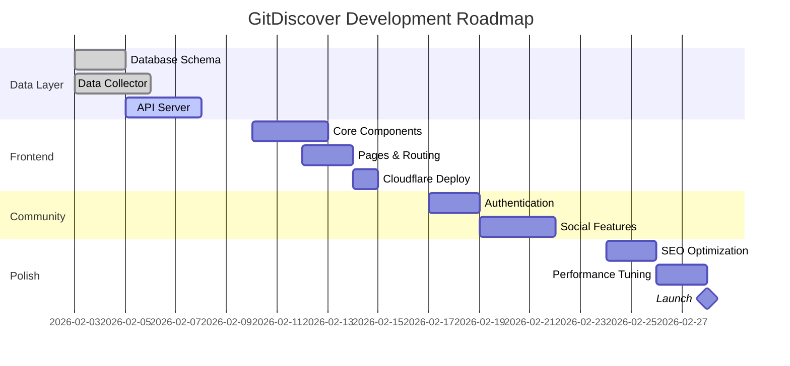

# GitDiscover Blueprint

> GitHub Discovery Platform - Product Hunt for GitHub

## Vision Statement

**GitDiscover** transforms how developers discover valuable open-source projects. By combining real-time trending data, community curation, and AI-powered insights, we surface the most impactful repositories and developers daily.

## Core Value Proposition

| For | Pain Point | Our Solution |
|-----|------------|--------------|
| Developers | GitHub Trending is shallow, no context | AI-powered deep analysis + community insights |
| OSS Maintainers | Hard to get discovered | Fair ranking algorithm + exposure to engaged audience |
| Tech Leaders | Miss emerging tools/trends | Daily curated digest + trend analytics |

## Competitive Differentiation

```
┌────────────────────────────────────────────────────────────────┐
│                    Competitive Landscape                        │
├────────────────────┬───────────────┬───────────────┬───────────┤
│ Feature            │ GitHub        │ OSS Insight   │ GitDiscover│
├────────────────────┼───────────────┼───────────────┼───────────┤
│ Real-time Trending │ Daily only    │ Yes           │ Yes        │
│ Developer Ranking  │ No            │ Limited       │ Yes        │
│ AI Analysis        │ No            │ No            │ Yes        │
│ Community Features │ No            │ No            │ Yes        │
│ Trend Analytics    │ Basic         │ Yes           │ Yes        │
│ Cost               │ Free          │ Free          │ Free       │
│ API Access         │ Rate Limited  │ Limited       │ Open       │
└────────────────────┴───────────────┴───────────────┴───────────┘
```

### Unique Selling Points

1. **AI Deep Dive**: GPT-4o-mini analyzes Top 10 daily repos
2. **Developer Discovery**: First platform to rank developers by impact
3. **Community Curation**: Bookmarks, comments, votes shape rankings
4. **Trend Intelligence**: Historical data reveals emerging patterns

## Product Features

### MVP (Week 1-2)

```yaml
Discovery:
  - Daily Top 50 repositories
  - Filter by language (20+ languages)
  - Sort by: stars growth, forks growth, score
  - Repository detail page with stats

Developer:
  - Daily Top 30 developers
  - Impact score calculation
  - Developer profile with top repos

Basic UI:
  - Responsive design
  - Dark/light mode
  - Search functionality
```

### V1.0 (Week 3-4)

```yaml
Community:
  - User authentication (GitHub OAuth)
  - Bookmark repositories
  - Comment on repositories
  - Upvote/downvote system

AI Insights:
  - Daily Top 10 AI analysis
  - Code quality assessment
  - Use case suggestions
  - Similar project recommendations

Analytics:
  - Language trend charts
  - Weekly/monthly rankings
  - Growth velocity tracking
```

### V2.0 (Future)

```yaml
Advanced:
  - Personalized recommendations
  - Email digest subscription
  - API for third-party integration
  - Browser extension
  - Mobile app (PWA)

Monetization:
  - Premium features (advanced analytics)
  - Sponsored listings
  - Enterprise API access
```

## Product Roadmap



## Success Metrics & KPIs

### North Star Metric

**Daily Active Users (DAU)** - Primary indicator of product value

### Key Performance Indicators

| Category | Metric | MVP Target | V1.0 Target |
|----------|--------|------------|-------------|
| **Growth** | DAU | 100 | 1,000 |
| | WAU | 500 | 5,000 |
| | MAU | 1,000 | 10,000 |
| **Engagement** | Avg. Session Duration | 2 min | 5 min |
| | Pages per Session | 3 | 7 |
| | Bounce Rate | < 60% | < 40% |
| **Community** | Registered Users | 50 | 500 |
| | Bookmarks/User | 5 | 15 |
| | Comments/Day | 10 | 100 |
| **Technical** | Page Load (P95) | < 2s | < 1s |
| | API Response (P95) | < 500ms | < 200ms |
| | Uptime | 99% | 99.9% |
| **SEO** | Organic Traffic | 20% | 50% |
| | Indexed Pages | 1,000 | 10,000 |

### Tracking Implementation

```typescript
// Analytics events to track
const EVENTS = {
  // Discovery
  VIEW_REPO_LIST: 'view_repo_list',
  VIEW_REPO_DETAIL: 'view_repo_detail',
  VIEW_DEVELOPER_LIST: 'view_developer_list',
  VIEW_DEVELOPER_DETAIL: 'view_developer_detail',

  // Engagement
  FILTER_BY_LANGUAGE: 'filter_by_language',
  SORT_REPOS: 'sort_repos',
  SEARCH: 'search',

  // Community
  BOOKMARK_REPO: 'bookmark_repo',
  COMMENT_REPO: 'comment_repo',
  VOTE_REPO: 'vote_repo',

  // Conversion
  SIGN_UP: 'sign_up',
  SIGN_IN: 'sign_in',
} as const;
```

## Core Algorithms

### Repository Hotness Score

```typescript
/**
 * Calculate repository hotness score
 *
 * Formula: Score = (ΔStars_24h × 0.7) + (ΔForks_24h × 0.3) × Quality_Multiplier
 *
 * Quality Multiplier factors:
 * - Has README: +10%
 * - Has LICENSE: +5%
 * - Recent commits (< 30 days): +15%
 * - Low issue ratio: +10%
 */
interface RepoMetrics {
  starsGrowth24h: number;
  forksGrowth24h: number;
  hasReadme: boolean;
  hasLicense: boolean;
  lastCommitDays: number;
  openIssueRatio: number; // open / total
}

function calculateHotnessScore(metrics: RepoMetrics): number {
  const baseScore =
    (metrics.starsGrowth24h * 0.7) +
    (metrics.forksGrowth24h * 0.3);

  let multiplier = 1.0;

  if (metrics.hasReadme) multiplier += 0.10;
  if (metrics.hasLicense) multiplier += 0.05;
  if (metrics.lastCommitDays < 30) multiplier += 0.15;
  if (metrics.openIssueRatio < 0.3) multiplier += 0.10;

  return Math.round(baseScore * multiplier * 100) / 100;
}
```

### Developer Impact Score

```typescript
/**
 * Calculate developer impact score
 *
 * Formula: Impact = log10(Followers + 1) + (Active_Repos × 0.5)
 *
 * Active Repos: repos with commits in last 90 days
 */
interface DeveloperMetrics {
  followers: number;
  activeRepos: number; // repos with recent activity
  totalStars: number;  // sum of all repo stars
  contributions: number; // last year contributions
}

function calculateImpactScore(metrics: DeveloperMetrics): number {
  const followerScore = Math.log10(metrics.followers + 1);
  const repoScore = metrics.activeRepos * 0.5;
  const starBonus = Math.log10(metrics.totalStars + 1) * 0.3;
  const activityBonus = Math.min(metrics.contributions / 1000, 1) * 0.2;

  return Math.round((followerScore + repoScore + starBonus + activityBonus) * 100) / 100;
}
```

## Data Scale Projections

### Storage Estimates

| Data Type | Records | Size/Record | Total |
|-----------|---------|-------------|-------|
| Repositories | 200,000 | 5 KB | 1 GB |
| Daily Snapshots | 200,000 × 365 | 200 B | 14 GB |
| Developers | 50,000 | 2 KB | 100 MB |
| AI Analyses | 3,650 | 10 KB | 36 MB |
| Users | 10,000 | 1 KB | 10 MB |
| Bookmarks | 100,000 | 100 B | 10 MB |
| Comments | 50,000 | 500 B | 25 MB |
| **Total** | | | **~15 GB** |

### Processing Estimates

| Operation | Frequency | Volume | Duration |
|-----------|-----------|--------|----------|
| Full Sync | Daily | 200K repos | 2-3 hours |
| Incremental | Hourly | 10K repos | 10 min |
| Score Calc | Daily | 200K repos | 5 min |
| AI Analysis | Daily | 10 repos | 10 min |
| KV Sync | Hourly | 100 keys | 1 min |

### Cost Breakdown

| Service | Usage | Monthly Cost |
|---------|-------|--------------|
| VPS (4GB RAM) | 24/7 | $5 |
| PostgreSQL | 15GB | Included |
| Cloudflare Pages | Free tier | $0 |
| Cloudflare KV | 100K reads/day | $0 |
| OpenAI API | 300 calls/month | $3 |
| Domain | Annual | $1 |
| Backup Storage | 50GB | $2 |
| **Total** | | **~$11-15** |

## Risk Assessment

| Risk | Probability | Impact | Mitigation |
|------|-------------|--------|------------|
| GitHub API Rate Limit | High | Medium | Use GitHub Archive, implement caching |
| Data Accuracy | Medium | High | Multiple data sources, validation |
| Server Downtime | Low | High | Cloudflare failover, health checks |
| Cost Overrun | Low | Medium | Usage monitoring, alerts |
| Low Adoption | Medium | High | SEO focus, content marketing |

## Success Criteria

### MVP Launch (Week 2)

- [ ] 50+ daily trending repos displayed
- [ ] 30+ daily trending developers displayed
- [ ] < 2s page load time
- [ ] Mobile responsive
- [ ] Basic SEO implemented

### V1.0 Launch (Week 4)

- [ ] User authentication working
- [ ] Community features functional
- [ ] AI analysis for Top 10
- [ ] 99% uptime achieved
- [ ] 100+ registered users

### 3-Month Goals

- [ ] 1,000+ DAU
- [ ] 50% organic traffic
- [ ] 10,000+ indexed pages
- [ ] Featured in dev newsletters
- [ ] API documentation published

---

## Appendix: Competitive Analysis

### GitHub Trending

- **Pros**: Official, trusted, integrated
- **Cons**: No historical data, no community, basic filtering

### OSS Insight

- **Pros**: Deep analytics, beautiful visualizations
- **Cons**: Complex UI, no community features, slow updates

### GitDiscover Positioning

We fill the gap between GitHub's simplicity and OSS Insight's complexity, adding community curation and AI insights that neither offers.

---

Document Version: 1.0.0
Last Updated: 2026-02-01
