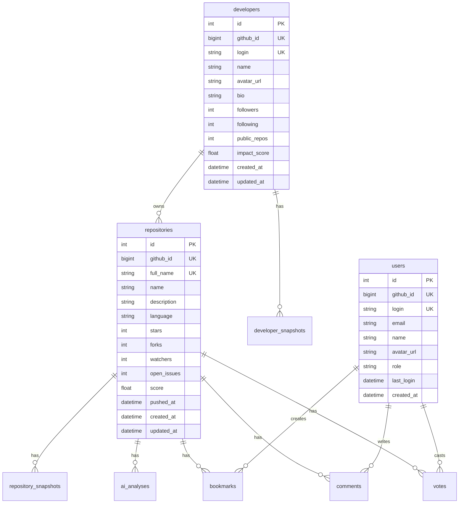

# GitDiscover Database Design

> PostgreSQL Schema with Prisma ORM

## Schema Overview



## Complete Prisma Schema

```prisma
// prisma/schema.prisma

generator client {
  provider        = "prisma-client-js"
  previewFeatures = ["fullTextSearch", "fullTextIndex"]
}

datasource db {
  provider = "postgresql"
  url      = env("DATABASE_URL")
}

// ============================================
// CORE ENTITIES
// ============================================

model Repository {
  id          Int      @id @default(autoincrement())
  githubId    BigInt   @unique @map("github_id")
  fullName    String   @unique @map("full_name") @db.VarChar(255)
  name        String   @db.VarChar(255)
  description String?  @db.Text
  language    String?  @db.VarChar(50)

  // Metrics
  stars       Int      @default(0)
  forks       Int      @default(0)
  watchers    Int      @default(0)
  openIssues  Int      @default(0) @map("open_issues")
  size        Int      @default(0)

  // Calculated scores
  score           Float    @default(0)
  starsGrowth24h  Int      @default(0) @map("stars_growth_24h")
  forksGrowth24h  Int      @default(0) @map("forks_growth_24h")

  // Metadata
  homepage    String?  @db.VarChar(500)
  topics      String[] @default([])
  license     String?  @db.VarChar(100)
  hasReadme   Boolean  @default(false) @map("has_readme")
  hasLicense  Boolean  @default(false) @map("has_license")
  isArchived  Boolean  @default(false) @map("is_archived")
  isFork      Boolean  @default(false) @map("is_fork")

  // Owner reference
  ownerId     Int?     @map("owner_id")
  owner       Developer? @relation(fields: [ownerId], references: [id])

  // Timestamps
  pushedAt    DateTime? @map("pushed_at")
  repoCreatedAt DateTime? @map("repo_created_at")
  createdAt   DateTime @default(now()) @map("created_at")
  updatedAt   DateTime @updatedAt @map("updated_at")

  // Relations
  snapshots   RepositorySnapshot[]
  analyses    AiAnalysis[]
  bookmarks   Bookmark[]
  comments    Comment[]
  votes       Vote[]

  @@index([language])
  @@index([score(sort: Desc)])
  @@index([stars(sort: Desc)])
  @@index([starsGrowth24h(sort: Desc)])
  @@index([updatedAt])
  @@index([language, score(sort: Desc)])
  @@map("repositories")
}

model Developer {
  id          Int      @id @default(autoincrement())
  githubId    BigInt   @unique @map("github_id")
  login       String   @unique @db.VarChar(100)
  name        String?  @db.VarChar(255)
  avatarUrl   String?  @map("avatar_url") @db.VarChar(500)
  bio         String?  @db.Text
  company     String?  @db.VarChar(255)
  location    String?  @db.VarChar(255)
  blog        String?  @db.VarChar(500)
  email       String?  @db.VarChar(255)
  twitterUsername String? @map("twitter_username") @db.VarChar(100)

  // Metrics
  followers   Int      @default(0)
  following   Int      @default(0)
  publicRepos Int      @default(0) @map("public_repos")
  publicGists Int      @default(0) @map("public_gists")

  // Calculated scores
  impactScore     Float @default(0) @map("impact_score")
  activeRepos     Int   @default(0) @map("active_repos")
  totalStars      Int   @default(0) @map("total_stars")
  contributions   Int   @default(0)

  // Timestamps
  devCreatedAt DateTime? @map("dev_created_at")
  createdAt   DateTime @default(now()) @map("created_at")
  updatedAt   DateTime @updatedAt @map("updated_at")

  // Relations
  repositories Repository[]
  snapshots    DeveloperSnapshot[]

  @@index([impactScore(sort: Desc)])
  @@index([followers(sort: Desc)])
  @@index([totalStars(sort: Desc)])
  @@map("developers")
}

model User {
  id          Int      @id @default(autoincrement())
  githubId    BigInt   @unique @map("github_id")
  login       String   @unique @db.VarChar(100)
  email       String?  @db.VarChar(255)
  name        String?  @db.VarChar(255)
  avatarUrl   String?  @map("avatar_url") @db.VarChar(500)

  // Auth
  role        Role     @default(USER)
  accessToken String?  @map("access_token") @db.VarChar(500)

  // Activity
  lastLoginAt DateTime? @map("last_login_at")
  createdAt   DateTime @default(now()) @map("created_at")
  updatedAt   DateTime @updatedAt @map("updated_at")

  // Relations
  bookmarks   Bookmark[]
  comments    Comment[]
  votes       Vote[]

  @@map("users")
}

enum Role {
  USER
  MODERATOR
  ADMIN
}

// ============================================
// TIME-SERIES DATA
// ============================================

model RepositorySnapshot {
  id            BigInt   @id @default(autoincrement())
  repositoryId  Int      @map("repository_id")
  snapshotDate  DateTime @map("snapshot_date") @db.Date

  // Metrics at snapshot time
  stars         Int
  forks         Int
  watchers      Int
  openIssues    Int      @map("open_issues")

  // Growth metrics
  starsGrowth   Int      @default(0) @map("stars_growth")
  forksGrowth   Int      @default(0) @map("forks_growth")

  // Calculated score at snapshot
  score         Float    @default(0)
  rank          Int?

  createdAt     DateTime @default(now()) @map("created_at")

  repository    Repository @relation(fields: [repositoryId], references: [id], onDelete: Cascade)

  @@unique([repositoryId, snapshotDate])
  @@index([snapshotDate])
  @@index([snapshotDate, score(sort: Desc)])
  @@index([snapshotDate, rank])
  @@map("repository_snapshots")
}

model DeveloperSnapshot {
  id            BigInt   @id @default(autoincrement())
  developerId   Int      @map("developer_id")
  snapshotDate  DateTime @map("snapshot_date") @db.Date

  // Metrics at snapshot time
  followers     Int
  publicRepos   Int      @map("public_repos")
  totalStars    Int      @map("total_stars")

  // Calculated score at snapshot
  impactScore   Float    @default(0) @map("impact_score")
  rank          Int?

  createdAt     DateTime @default(now()) @map("created_at")

  developer     Developer @relation(fields: [developerId], references: [id], onDelete: Cascade)

  @@unique([developerId, snapshotDate])
  @@index([snapshotDate])
  @@index([snapshotDate, impactScore(sort: Desc)])
  @@map("developer_snapshots")
}

// ============================================
// AI ANALYSIS
// ============================================

model AiAnalysis {
  id            Int      @id @default(autoincrement())
  repositoryId  Int      @map("repository_id")
  analysisDate  DateTime @map("analysis_date") @db.Date

  // Analysis content
  summary       String   @db.Text
  highlights    String[] @default([])
  useCases      String[] @default([]) @map("use_cases")
  techStack     Json?    @map("tech_stack")
  codeQuality   Json?    @map("code_quality")

  // Recommendations
  similarRepos  Int[]    @default([]) @map("similar_repos")
  targetAudience String? @map("target_audience") @db.VarChar(500)

  // Metadata
  modelVersion  String   @map("model_version") @db.VarChar(50)
  tokensUsed    Int      @default(0) @map("tokens_used")

  createdAt     DateTime @default(now()) @map("created_at")

  repository    Repository @relation(fields: [repositoryId], references: [id], onDelete: Cascade)

  @@unique([repositoryId, analysisDate])
  @@index([analysisDate])
  @@map("ai_analyses")
}

// ============================================
// COMMUNITY FEATURES
// ============================================

model Bookmark {
  id            Int      @id @default(autoincrement())
  userId        Int      @map("user_id")
  repositoryId  Int      @map("repository_id")

  note          String?  @db.Text
  tags          String[] @default([])

  createdAt     DateTime @default(now()) @map("created_at")

  user          User       @relation(fields: [userId], references: [id], onDelete: Cascade)
  repository    Repository @relation(fields: [repositoryId], references: [id], onDelete: Cascade)

  @@unique([userId, repositoryId])
  @@index([userId])
  @@index([repositoryId])
  @@map("bookmarks")
}

model Comment {
  id            Int      @id @default(autoincrement())
  userId        Int      @map("user_id")
  repositoryId  Int      @map("repository_id")
  parentId      Int?     @map("parent_id")

  content       String   @db.Text
  isEdited      Boolean  @default(false) @map("is_edited")
  isDeleted     Boolean  @default(false) @map("is_deleted")

  createdAt     DateTime @default(now()) @map("created_at")
  updatedAt     DateTime @updatedAt @map("updated_at")

  user          User       @relation(fields: [userId], references: [id], onDelete: Cascade)
  repository    Repository @relation(fields: [repositoryId], references: [id], onDelete: Cascade)
  parent        Comment?   @relation("CommentReplies", fields: [parentId], references: [id])
  replies       Comment[]  @relation("CommentReplies")

  @@index([repositoryId, createdAt(sort: Desc)])
  @@index([userId])
  @@map("comments")
}

model Vote {
  id            Int      @id @default(autoincrement())
  userId        Int      @map("user_id")
  repositoryId  Int      @map("repository_id")

  value         Int      // 1 for upvote, -1 for downvote

  createdAt     DateTime @default(now()) @map("created_at")
  updatedAt     DateTime @updatedAt @map("updated_at")

  user          User       @relation(fields: [userId], references: [id], onDelete: Cascade)
  repository    Repository @relation(fields: [repositoryId], references: [id], onDelete: Cascade)

  @@unique([userId, repositoryId])
  @@index([repositoryId])
  @@map("votes")
}

// ============================================
// SYSTEM TABLES
// ============================================

model SyncLog {
  id            Int      @id @default(autoincrement())
  syncType      String   @map("sync_type") @db.VarChar(50)
  status        String   @db.VarChar(20)

  recordsProcessed Int   @default(0) @map("records_processed")
  recordsFailed    Int   @default(0) @map("records_failed")

  startedAt     DateTime @map("started_at")
  completedAt   DateTime? @map("completed_at")

  errorMessage  String?  @map("error_message") @db.Text
  metadata      Json?

  @@index([syncType, startedAt(sort: Desc)])
  @@map("sync_logs")
}

model CacheInvalidation {
  id            Int      @id @default(autoincrement())
  cacheKey      String   @map("cache_key") @db.VarChar(255)
  reason        String   @db.VarChar(100)

  invalidatedAt DateTime @default(now()) @map("invalidated_at")

  @@index([invalidatedAt])
  @@map("cache_invalidations")
}
```

## Index Strategy

### Primary Indexes (Created by Prisma)

```sql
-- Unique constraints create indexes automatically
-- repositories.github_id (unique)
-- repositories.full_name (unique)
-- developers.github_id (unique)
-- developers.login (unique)
-- users.github_id (unique)
-- users.login (unique)
```

### Performance Indexes

```sql
-- High-traffic query indexes
-- These are defined in the Prisma schema above

-- Additional indexes for complex queries (run manually)

-- Full-text search on repositories
CREATE INDEX CONCURRENTLY idx_repos_fulltext
ON repositories USING GIN (
  to_tsvector('english', coalesce(name, '') || ' ' || coalesce(description, ''))
);

-- Composite index for trending page
CREATE INDEX CONCURRENTLY idx_repos_trending_composite
ON repositories (language, score DESC, stars_growth_24h DESC)
WHERE is_archived = false;

-- Covering index for list queries
CREATE INDEX CONCURRENTLY idx_repos_list_covering
ON repositories (score DESC)
INCLUDE (github_id, full_name, name, description, language, stars, forks);

-- Time-range queries on snapshots
CREATE INDEX CONCURRENTLY idx_snapshots_range
ON repository_snapshots (repository_id, snapshot_date DESC);

-- Developer leaderboard
CREATE INDEX CONCURRENTLY idx_devs_leaderboard
ON developers (impact_score DESC)
INCLUDE (login, name, avatar_url, followers, total_stars);
```

### Index Maintenance

```sql
-- Monitor index usage
SELECT
  schemaname,
  tablename,
  indexname,
  idx_scan,
  idx_tup_read,
  idx_tup_fetch
FROM pg_stat_user_indexes
ORDER BY idx_scan DESC;

-- Find unused indexes
SELECT
  schemaname || '.' || tablename AS table,
  indexname,
  pg_size_pretty(pg_relation_size(indexrelid)) AS size
FROM pg_stat_user_indexes
WHERE idx_scan = 0
  AND indexrelid::regclass::text NOT LIKE '%_pkey';

-- Reindex bloated indexes
REINDEX INDEX CONCURRENTLY idx_repos_score;
```

## Query Patterns

### Trending Repositories

```typescript
// Get daily trending repos with pagination
async function getTrendingRepos(params: {
  language?: string;
  limit?: number;
  cursor?: number;
}) {
  const { language, limit = 20, cursor } = params;

  return prisma.repository.findMany({
    where: {
      isArchived: false,
      ...(language && { language }),
      ...(cursor && { id: { lt: cursor } }),
    },
    orderBy: [
      { score: 'desc' },
      { starsGrowth24h: 'desc' },
    ],
    take: limit,
    select: {
      id: true,
      githubId: true,
      fullName: true,
      name: true,
      description: true,
      language: true,
      stars: true,
      forks: true,
      starsGrowth24h: true,
      forksGrowth24h: true,
      score: true,
      topics: true,
      owner: {
        select: {
          login: true,
          avatarUrl: true,
        },
      },
    },
  });
}
```

### Repository Detail with Stats

```typescript
// Get repository with historical data
async function getRepoDetail(fullName: string) {
  const repo = await prisma.repository.findUnique({
    where: { fullName },
    include: {
      owner: true,
      analyses: {
        orderBy: { analysisDate: 'desc' },
        take: 1,
      },
      _count: {
        select: {
          bookmarks: true,
          comments: true,
          votes: true,
        },
      },
    },
  });

  if (!repo) return null;

  // Get 30-day history
  const history = await prisma.repositorySnapshot.findMany({
    where: {
      repositoryId: repo.id,
      snapshotDate: {
        gte: new Date(Date.now() - 30 * 24 * 60 * 60 * 1000),
      },
    },
    orderBy: { snapshotDate: 'asc' },
    select: {
      snapshotDate: true,
      stars: true,
      forks: true,
      score: true,
    },
  });

  // Get vote summary
  const votes = await prisma.vote.aggregate({
    where: { repositoryId: repo.id },
    _sum: { value: true },
  });

  return {
    ...repo,
    history,
    voteScore: votes._sum.value || 0,
  };
}
```

### Developer Leaderboard

```typescript
// Get top developers
async function getTopDevelopers(params: {
  limit?: number;
  cursor?: number;
}) {
  const { limit = 30, cursor } = params;

  return prisma.developer.findMany({
    where: cursor ? { id: { lt: cursor } } : undefined,
    orderBy: { impactScore: 'desc' },
    take: limit,
    select: {
      id: true,
      githubId: true,
      login: true,
      name: true,
      avatarUrl: true,
      bio: true,
      followers: true,
      publicRepos: true,
      totalStars: true,
      impactScore: true,
      _count: {
        select: {
          repositories: true,
        },
      },
    },
  });
}
```

### User Bookmarks

```typescript
// Get user's bookmarked repos
async function getUserBookmarks(userId: number) {
  return prisma.bookmark.findMany({
    where: { userId },
    orderBy: { createdAt: 'desc' },
    include: {
      repository: {
        select: {
          id: true,
          fullName: true,
          name: true,
          description: true,
          language: true,
          stars: true,
          score: true,
        },
      },
    },
  });
}
```

### Full-Text Search

```typescript
// Search repositories
async function searchRepos(query: string, limit = 20) {
  // Using raw query for full-text search
  return prisma.$queryRaw`
    SELECT
      id,
      github_id as "githubId",
      full_name as "fullName",
      name,
      description,
      language,
      stars,
      forks,
      score,
      ts_rank(
        to_tsvector('english', coalesce(name, '') || ' ' || coalesce(description, '')),
        plainto_tsquery('english', ${query})
      ) as rank
    FROM repositories
    WHERE
      to_tsvector('english', coalesce(name, '') || ' ' || coalesce(description, ''))
      @@ plainto_tsquery('english', ${query})
    ORDER BY rank DESC, score DESC
    LIMIT ${limit}
  `;
}
```

## Data Migration Plan

### Initial Migration

```bash
# Generate migration from schema
npx prisma migrate dev --name init

# Apply to production
npx prisma migrate deploy
```

### Migration Scripts

```typescript
// prisma/migrations/seed.ts
import { PrismaClient } from '@prisma/client';

const prisma = new PrismaClient();

async function main() {
  // Seed initial languages for filtering
  const languages = [
    'JavaScript', 'TypeScript', 'Python', 'Java', 'Go',
    'Rust', 'C++', 'C', 'Ruby', 'PHP', 'Swift', 'Kotlin',
    'Scala', 'Haskell', 'Elixir', 'Clojure', 'Dart', 'Lua',
    'Shell', 'HTML', 'CSS', 'Vue', 'Svelte',
  ];

  console.log('Database seeded successfully');
}

main()
  .catch(console.error)
  .finally(() => prisma.$disconnect());
```

### Schema Evolution

```prisma
// Example: Adding a new field
model Repository {
  // ... existing fields

  // New field with default (non-breaking)
  trendingRank Int? @map("trending_rank")
}

// Migration command
// npx prisma migrate dev --name add_trending_rank
```

## Backup Strategy

### Automated Backups

```bash
#!/bin/bash
# scripts/backup-db.sh

set -e

BACKUP_DIR="/backups/postgres"
DATE=$(date +%Y%m%d_%H%M%S)
BACKUP_FILE="$BACKUP_DIR/gitdiscover_$DATE.dump"

# Create backup directory
mkdir -p $BACKUP_DIR

# Dump database
docker compose exec -T postgres pg_dump \
  -U gitdiscover \
  -Fc \
  --no-owner \
  --no-acl \
  gitdiscover > $BACKUP_FILE

# Compress
gzip $BACKUP_FILE

# Upload to B2
rclone copy $BACKUP_FILE.gz b2:gitdiscover-backups/postgres/

# Cleanup old local backups (keep 7 days)
find $BACKUP_DIR -name "*.dump.gz" -mtime +7 -delete

echo "Backup completed: $BACKUP_FILE.gz"
```

### Point-in-Time Recovery

```bash
# Enable WAL archiving in postgresql.conf
archive_mode = on
archive_command = 'cp %p /backups/wal/%f'
wal_level = replica

# Restore to specific point
pg_restore \
  --target-time="2026-02-01 12:00:00" \
  --target-action=promote \
  -d gitdiscover_restore \
  /backups/gitdiscover_20260201.dump
```

### Recovery Testing

```sql
-- Verify backup integrity
SELECT COUNT(*) as repos FROM repositories;
SELECT COUNT(*) as devs FROM developers;
SELECT COUNT(*) as snapshots FROM repository_snapshots;
SELECT MAX(snapshot_date) as latest_snapshot FROM repository_snapshots;

-- Compare with production
-- Should match within acceptable delta
```

## Query Optimization

### Slow Query Analysis

```sql
-- Enable query logging
ALTER SYSTEM SET log_min_duration_statement = 100; -- ms
SELECT pg_reload_conf();

-- Find slow queries
SELECT
  query,
  calls,
  mean_exec_time,
  total_exec_time,
  rows
FROM pg_stat_statements
ORDER BY mean_exec_time DESC
LIMIT 20;
```

### Query Plan Analysis

```sql
-- Analyze trending query
EXPLAIN (ANALYZE, BUFFERS, FORMAT TEXT)
SELECT *
FROM repositories
WHERE language = 'TypeScript'
  AND is_archived = false
ORDER BY score DESC
LIMIT 20;

-- Expected: Index Scan using idx_repos_trending_composite
```

### Connection Pooling

```ini
# pgbouncer.ini
[databases]
gitdiscover = host=localhost port=5432 dbname=gitdiscover

[pgbouncer]
listen_addr = 0.0.0.0
listen_port = 6432
auth_type = md5
auth_file = /etc/pgbouncer/userlist.txt

pool_mode = transaction
max_client_conn = 200
default_pool_size = 25
min_pool_size = 5
reserve_pool_size = 5

# Timeouts
server_connect_timeout = 5
server_idle_timeout = 60
server_lifetime = 3600
```

## Data Retention Policy

```sql
-- Retention policy for snapshots (keep 1 year)
DELETE FROM repository_snapshots
WHERE snapshot_date < NOW() - INTERVAL '1 year';

-- Retention policy for sync logs (keep 30 days)
DELETE FROM sync_logs
WHERE started_at < NOW() - INTERVAL '30 days';

-- Retention policy for cache invalidations (keep 7 days)
DELETE FROM cache_invalidations
WHERE invalidated_at < NOW() - INTERVAL '7 days';

-- Schedule with pg_cron
SELECT cron.schedule('retention-cleanup', '0 3 * * *', $$
  DELETE FROM repository_snapshots WHERE snapshot_date < NOW() - INTERVAL '1 year';
  DELETE FROM sync_logs WHERE started_at < NOW() - INTERVAL '30 days';
  DELETE FROM cache_invalidations WHERE invalidated_at < NOW() - INTERVAL '7 days';
  VACUUM ANALYZE;
$$);
```

## Monitoring Queries

```sql
-- Database size
SELECT
  pg_database.datname,
  pg_size_pretty(pg_database_size(pg_database.datname)) AS size
FROM pg_database
WHERE datname = 'gitdiscover';

-- Table sizes
SELECT
  tablename,
  pg_size_pretty(pg_total_relation_size(schemaname || '.' || tablename)) AS total_size,
  pg_size_pretty(pg_relation_size(schemaname || '.' || tablename)) AS table_size,
  pg_size_pretty(pg_indexes_size(schemaname || '.' || tablename)) AS index_size
FROM pg_tables
WHERE schemaname = 'public'
ORDER BY pg_total_relation_size(schemaname || '.' || tablename) DESC;

-- Active connections
SELECT
  state,
  COUNT(*) as count,
  MAX(NOW() - state_change) as max_duration
FROM pg_stat_activity
WHERE datname = 'gitdiscover'
GROUP BY state;

-- Cache hit ratio (should be > 99%)
SELECT
  sum(heap_blks_hit) / (sum(heap_blks_hit) + sum(heap_blks_read)) AS cache_hit_ratio
FROM pg_statio_user_tables;
```

---

Document Version: 1.0.0
Last Updated: 2026-02-01
